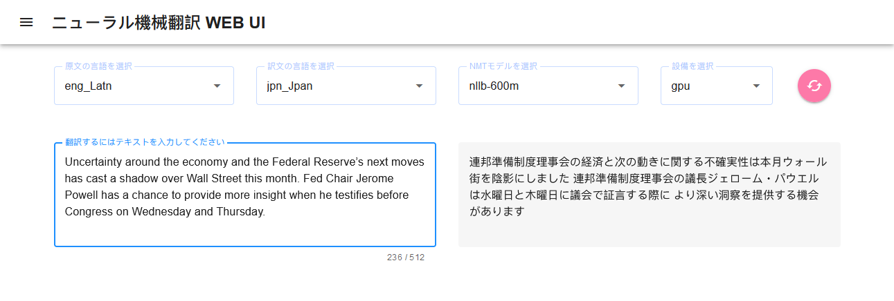
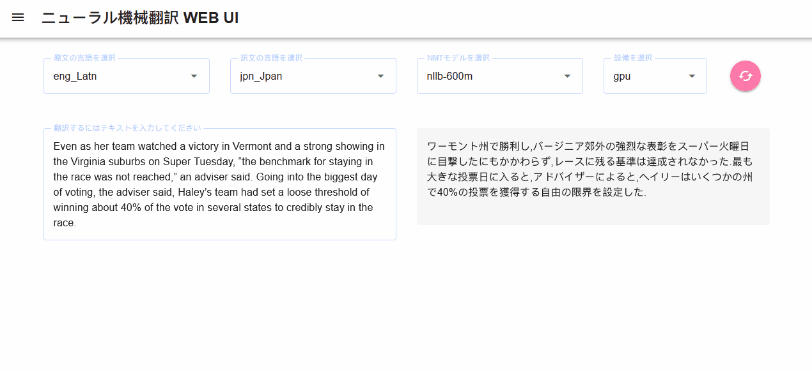

# nmt_web_ui
flask と vue を使用した NMT 用の Web UI



## Run Project

### デバイス要件とシステム環境
- Linux(推薦) + GPU(推薦)
- GPUを使用する場合は、nvidiaドライバーとcudaまたはAMDドライバーとROCmを適切にインストールする、その上に。GPUのVRAMは4G以上そしてcuda のバージョンは 11 以降　ROCm のバージョンは 5 以降であるほうがいいと思う。
- nodejs 18+
- python >= 3.6
- ディープラーニングフレームワークはpytorch>= 1.10ほうがいいとおもう、インストールについては[pytorch (https://pytorch.org/get-started/locally)](https://pytorch.org/get-started/locally)のこうしきペイジに参考してください。

### Vueの部分
```sh
cd frontend
npm install
cd ..
```

### サーバ（Pythonとモデル）の部分
1. モデルファイルを [huggingface](https://huggingface.co/models?pipeline_tag=translation)からダウンロードして、[models](backend/nmt/models)にに入れおきます。モデルって例えば[facebookのnllb](https://huggingface.co/facebook/nllb-200-distilled-600M)、そしてほがの
2. [config.yaml.example](backend/nmt/config.yaml.example)に参考して[config.yaml](backend/nmt/config.yaml)を編集します。
3. run.pyを実行する。
```sh
conda create -n nmt_web_ui python=3.10 -y
conda activate nmt_web_ui
pip install -r requirements.txt
python run.py
```
### 最後、http://localhost:5000 にvue ページをアクセスできる。

## Develop Project

### Compile and Hot-Reload for vue Development

```sh
cd frontend
npm run dev
```

### Type-Check, Compile and Minify for Production

```sh
cd frontend
npm run build
```

## 操作効果表示


## Recommended IDE
[https://code.visualstudio.com](https://code.visualstudio.com/)
